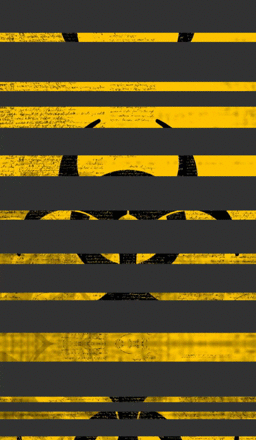
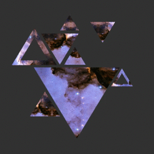

## Layers masking effect using OpenGL ES shader with libGDX

This example shows the basics of using texture alpha masks with multiple layers and how to create complex effects using this neat trick. The source code will be based on the `libGDX` framework and written in Java. Custom pixel shader used with `SpriteBatch` will be required for this effect to work. Basically what this effect does is that it takes as input two textures, the first one is called the layer texture and second the mask texture. The mask texture determines the opacity of each pixel. The additional enhancement is to apply rotation, scaling and translation to those layers (by vertex position or UV coord transform) to create effects like in these examples below:

<table>
<tr>
<td></td>
<td></td>
</tr>
<tr>
<td colspan="2"></td>
</tr>
</table>

## What is libGDX?
Libgdx is a Java game development framework which provides an unified cross-platform API. LibGDX allows to easily deploy OpenGL ES applications to desktop (because of JVM), Android and iOS. It supports also 2D physics (there's a JNI wrapper for Box2D) and 3D physics (JNI wrapper for Bullet Physics). The bitmap fonts can be generated on the fly from TTF files which is really useful (plus there's support for localization). More information on how to setup basic libGFX project can be found [here](https://libgdx.com/wiki/start/setup). LibGDX is a framework and not a complete game engine.

## Layer information structure
Each layer of the effect has some unique properties like position, size, current rotation, used textures, scaling and so on. One single effect can be composed of multiple layers. Those layers will be later rendered using custom shader setup and SpriteBatch (2D rendering). Note that because second texture unit is being used with this shader the sprite batch needs to be flushed after every layer (here flushing means that any pending sprites are rendered and the batch becomes empty again). Basic structure of *LayerInfo* class:

| Property                      | Description                                                                          |
| ----------------------------- | ------------------------------------------------------------------------------------ |
| `Texture texture`             | layer standard texture (diffuse, texture unit index 0)                               |
| `Texture maskTexture`         | additional mask texture (texture unit index 1)                                       |
| `Vector2 size`                | size of the layer (and the mask) in pixels                                           |
| `Vector2 position`            | current position (center)                                                            |
| `Vector2 realPos`             | real position (rectangle corner)                                                     |
| `Vector2 offset`              | current mask offset value in screen pixels                                           |
| `Vector2 maskOffset`          | current offset for mask in UV space                                                  |
| `Vector2 layerOffset`         | current offset value in screen pixels – layer only                                   |
| `float speed`                 | speed of the effect (when scaling/pulsing)                                           |
| `float direction`             | current direction of the effect (grow / shrink)                                      |
| `float rotation`              | current rotation of the layer (centered) in degrees                                  |
| `float rotationSpeed`         | rotation speed (degrees per second – can be less than < 0.0)                         |
| `float scale`                 | current scale value                                                                  |
| `float maskScale`             | current scale value of the mask                                                      |
| `float layerScale`            | current scale value for layer only                                                   |
| `float minScale`              | minimal scale allowed                                                                |
| `float maxScale`              | maximal scale allowed                                                                |
| `Interpolation interpolation` | interpolation method to use when calculating scale (sine as default)                 |
| `float scaleRatio`            | ratio value (between 0.0 and 1.0) to use with interpolation function                 |
| `Mode scaleMode`              | what element should be change with pulsing (scaling), layer only, mask only or both? |
| `Mode offsetMode`             | for which texture should the offset be applied to?                                   |

## Applying offset and scaling to layer
Offsets and scaling can be applied separately or together to both layer and masking texture. That's why *scaleMode* and *offsetMode* are used. If *offsetMode* is set to **layer only** then the final position of the layer 2D rectangle will be moved by number of pixels set in *layerOffset* vector. If it's set to **mask only** then the offset is converted to UV space and the special shader uniform variable will be updated. The same method applies to scaling (there is a separate scale for the layer and the mask). The offset needs to be set externally - the scale is interpolated in `LayerInfo.update()` function. The **delta** parameter is in seconds.

```java
public void update(float delta) {
    if (shouldPulse) {
        scaleRatio += direction * delta * speed;
        if(scaleRatio >= 1.0f) {
            scaleRatio = 1.0f;
            direction = -1.0f;
        } else if(scaleRatio < 0.0f) {
            scaleRatio = 0.0f;
            direction = 1.0f;
        }
        scale = interpolation.apply(minScale, maxScale, scaleRatio);
    }

    float maskOffsetScale = 1.0f;
    if (scaleMode == Mode.BOTH) {
        maskScale = scale;
        layerScale = scale;
    } else if (scaleMode == Mode.LAYER_ONLY) {
        layerScale = scale;
        maskScale = 1.0f;
        maskOffsetScale = 1.0f / scale;
    } else if (scaleMode == Mode.MASK_ONLY) {
        layerScale = 1.0f;
        maskScale = scale;
        maskOffsetScale = scale;
    }
    rotation += rotationSpeed * delta;

    if (rotation <= 0.0f) {
        rotation = 360.0f - rotation;
    } else if (rotation > 360.0f) {
        rotation = rotation - 360.0f;
    }

    realPos.x = position.x - size.x * layerScale / 2.0f + layerOffset.x;
    realPos.y = position.y - size.y * layerScale / 2.0f - layerOffset.y;
}
```

Layer position is stored separately in *position* and *realPos* - one describes position aligned to bottom left corner and the latter describes the final centered position of the layer. The scaling and rotation needs to be aligned to center, also the `SpriteBatch.draw()` takes quite complicated list of parameters to draw a rectangle that is scaled, rotated and aligned. The rotation angle is in degrees.

Offset needs to be set by externally using special functions. Offset value depends on what type of *scaleMode* and *offsetMode* is being used and on current scale value. Value of mask texture coordinate offset needs to be scaled properly to achieve more natural effect (otherwise it would move too quickly and the layer position would not align with the mask texture). To achieve the effect in which the texture layer is still and the mask texture is moving over it revealing different parts of the original texture, scaling needs to be turned off (*shouldPulse* set to false) and *offsetMode* needs to be set to **both**. Why offset needs to be applied both to layer (as translation in screen space) and to UV coordinates? Position of the rectangle on which both textures are being drawn is not static, so texture coordinates need to change accordingly to compensate for this movement.

```java
public void setOffset(int x, int y) {
    float diffX = x - offset.x;
    float diffY = y - offset.y;

    moveOffsetByPixels((int) diffX, (int) diffY);
    if (x == 0 && y == 0) {
        resetOffset();
    }
}

public void moveOffsetByPixels(int x, int y) {
    float maskOffsetScale = 1.0f;
    if (scaleMode == Mode.LAYER_ONLY) {
        maskOffsetScale = 1.0f / scale;
    } else if (scaleMode == Mode.MASK_ONLY) {
        maskOffsetScale = scale;
    }

    if (offsetMode != Mode.BOTH)
        maskOffsetScale = 1.0f;

    offset.x += (float) x;
    offset.y += (float) y;

    if (offsetMode != Mode.LAYER_ONLY) {
        maskOffset.x = offset.x / size.x * maskOffsetScale;
        maskOffset.y = offset.y / size.y * maskOffsetScale;
    }
    // Layer offset is now in screen space so can use it directly
    if (offsetMode != Mode.MASK_ONLY) {
        layerOffset.x += (float) x;
        layerOffset.y += (float) y;
    }
}
```

## Drawing single layer
The `LayerMaskingEffect` contains an array of `LayerInfo` and a pointer to external `AssetManager` (provided by libGDX API) used for easy retrieval of texture objects. Also the class for layer masking effect contains helper functions for drawing, adding new layers and adjusting offsets for all layers in the effect. Remember that custom shader code (pixel shader) is being used with the sprite batch (which is initialized in `LayerMaskingEffectDrawer`). Various shader uniforms need to be set before drawing. This includes single floats for the mask scale and whether or not the mask texture is being used. The mask texture needs to be bound manually. After drawing the textured layer rectangle the sprite batch needs to be flushed. It's because of the second texture unit. Without flushing the batch, all layers would be drawn using the same mask texture (whichever was bound as last). Below is the code used for drawing layer directly onto the screen.

```java
public void draw(SpriteBatch batch) {
    if (this.texture == null || batch == null || visible == false)
        return;
    ShaderProgram shader = batch.getShader();
    if (this.maskTexture != null) {
        shader.setUniformf("u_maskScale", this.maskScale);
        shader.setUniformf("u_useMask", 1.0f);
        if (shader.hasUniform("u_maskOffset"))
            shader.setUniformf("u_maskOffset", this.maskOffset.x, this.maskOffset.y);
        Gdx.gl.glActiveTexture(GL20.GL_TEXTURE1);
        this.maskTexture.bind(1);
    } else {
        shader.setUniformf("u_maskScale", 1.0f);
        shader.setUniformf("u_useMask", 0.0f);
        if (shader.hasUniform("u_maskOffset"))
            shader.setUniformf("u_maskOffset", 0.0f, 0.0f); 
    }

    Gdx.gl.glActiveTexture(GL20.GL_TEXTURE0);

    batch.draw(this.texture,
            realPos.x,
            realPos.y,
            size.x * layerScale / 2.0f,
            size.y * layerScale / 2.0f,
            size.x * layerScale,
            size.y * layerScale,
            1.0f, 1.0f,
            rotation,
            0, 0,
            this.texture.getWidth(),
            this.texture.getHeight(),
            false, false);

    // need to flush when using additional texture
    batch.flush(); 
}
```

## Shader source code

```glsl
#ifdef GL_ES
precision mediump float;
#endif
varying vec4 v_color;
varying vec2 v_texCoords;

// Layer texture to use
uniform sampler2D u_texture;
// Masking texture to use
uniform sampler2D u_texture2;

// Current mask scale factor
uniform float u_maskScale;
// Whether or not to use the masking texture color
uniform float u_useMask;
// Current mask offset (in UV coordinates)
uniform vec2 u_maskOffset;

void main()
{
    // Calculate new coordinates - this equation aligns the coordinates to center.
    // Mask offset is calculated inside the application - this offset is in UV coordinates space.
    // Please note that texture wrap should be enabled and set to repeat or to mirror repeat.
    vec2 newCoords = -1.0 * (u_maskScale - 1.0)/2.0 + (u_maskScale * v_texCoords) + u_maskOffset;
    vec4 mask = vec4(1.0, 1.0, 1.0, 1.0);
    if(u_useMask > 0.5)
        mask = texture2D(u_texture2, v_texCoords);
    vec4 color = v_color * texture2D(u_texture, newCoords);
    // Final fragment color alpha is determined by the mask color value
    gl_FragColor = vec4(color.rgb, color.a * mask.r);
}
```

## Various examples



This effect is quite easy to achieve - it's better to use 8 different layers configured separately than a single mask texture containing 8 triangles. That way it will be more flexible and each triangle can have different scaling/offset method and different layer texture. Here each layer has fixed position and three of them are rotated by 180 degrees. Offset is set externally - there is no interpolation method for layer/mask offsets in `LayerInfo.update()` function. Scaling is disabled and *offsetMode* is set to **mask only**.

```java
layerEffects[6] = layersDrawer.createLayerEffect("EffectTriangles6");
layerEffects[6].hide();

float _centerX = getBaseScreenWidth() / 2;
float _centerY = getBaseScreenHeight() / 2;
float _width = getBaseScreenWidth();
float _height = getBaseScreenHeight();
float mainTriangleSize = _width / 1.75f;

int[][] _offsets = {
        {0, 0},
        {-200, 300},
        {-80, 275},
        {-10, 260},
        {-35, 420},
        {120, 360},
        {210, 150},
        {-150, 30}};
{
    int _lid = 0;
    LayerInfo layerInfo = layerEffects[6].addLayer("layers/16_1024.tga",
            "masks/triangle_0.tga");
    layerInfo.position.x = _centerX + _offsets[_lid][0];
    layerInfo.position.y = _centerY + _offsets[_lid][1];

    layerInfo.size.x = mainTriangleSize;
    layerInfo.size.y = mainTriangleSize;
    layerInfo.rotation = 180.0f;
} // [0] flipped big triangle
{
    int _lid = 1;
    float _triangleSize = _width / 3.0f;
    LayerInfo layerInfo = layerEffects[6].addLayer("layers/16_1024.tga",
            "masks/triangle_1.tga");
    layerInfo.position.x = _centerX + _offsets[_lid][0];
    layerInfo.position.y = _centerY + _offsets[_lid][1];

    layerInfo.size.x = _triangleSize;
    layerInfo.size.y = _triangleSize;
    layerInfo.rotation = 0.0f;
} // [1] top left medium triangle
{
    int _lid = 2;
    float _triangleSize = _width / 4.0f;
    LayerInfo layerInfo = layerEffects[6].addLayer("layers/16_1024.tga",
            "masks/triangle_0.tga");
    layerInfo.position.x = _centerX + _offsets[_lid][0];
    layerInfo.position.y = _centerY + _offsets[_lid][1];

    layerInfo.size.x = _triangleSize;
    layerInfo.size.y = _triangleSize;
    layerInfo.rotation = 180.0f;
} // [2] top left smaller flipped triangle
{
    int _lid = 3;
    float _triangleSize = _width / 7.0f;
    LayerInfo layerInfo = layerEffects[6].addLayer("layers/16_1024.tga",
            "masks/triangle_0.tga");
    layerInfo.position.x = _centerX + _offsets[_lid][0];
    layerInfo.position.y = _centerY + _offsets[_lid][1];

    layerInfo.size.x = _triangleSize;
    layerInfo.size.y = _triangleSize;
    layerInfo.rotation = 0.0f;
} // [3] top center small triangle
{
    int _lid = 4;
    float _triangleSize = _width / 8.0f;
    LayerInfo layerInfo = layerEffects[6].addLayer("layers/16_1024.tga",
            "masks/triangle_0.tga");
    layerInfo.position.x = _centerX + _offsets[_lid][0];
    layerInfo.position.y = _centerY + _offsets[_lid][1];

    layerInfo.size.x = _triangleSize;
    layerInfo.size.y = _triangleSize;
    layerInfo.rotation = 0.0f;
} // [4] top center smaller triangle
{
    int _lid = 5;
    float _triangleSize = _width / 6.0f;
    LayerInfo layerInfo = layerEffects[6].addLayer("layers/16_1024.tga",
            "masks/triangle_0.tga");
    layerInfo.position.x = _centerX + _offsets[_lid][0];
    layerInfo.position.y = _centerY + _offsets[_lid][1];

    layerInfo.size.x = _triangleSize;
    layerInfo.size.y = _triangleSize;
    layerInfo.rotation = 180.0f;
} // [5] top right smaller triangle flipped
{
    int _lid = 6;
    float _triangleSize = _width / 5.0f;
    LayerInfo layerInfo = layerEffects[6].addLayer("layers/16_1024.tga",
            "masks/triangle_1.tga");
    layerInfo.position.x = _centerX + _offsets[_lid][0];
    layerInfo.position.y = _centerY + _offsets[_lid][1];

    layerInfo.size.x = _triangleSize * 0.8f;
    layerInfo.size.y = _triangleSize * 0.8f;
    layerInfo.rotation = 0.0f;
} // [6] bottom right smaller triangle
{
    int _lid = 7;
    float _triangleSize = _width / 4.0f;
    LayerInfo layerInfo = layerEffects[6].addLayer("layers/16_1024.tga",
            "masks/triangle_0.tga");
    layerInfo.position.x = _centerX + _offsets[_lid][0];
    layerInfo.position.y = _centerY + _offsets[_lid][1];

    layerInfo.size.x = _triangleSize * 0.8f;
    layerInfo.size.y = _triangleSize * 0.8f;
    layerInfo.rotation = 0.0f;
} // [7] bottom left small triangle
{
    for(int i =0;i<layerEffects[6].count();i++) {
        LayerInfo layerInfo = layerEffects[6].get(i);
        layerInfo.shouldPulse = false;
        layerInfo.speed = 0.0f;
        layerInfo.visible = true;
        layerInfo.offsetMode = LayerInfo.Mode.MASK_ONLY;
        layerInfo.setScale(1.0f);
    }
}
```

---


In this example the effect is using 4 layers. Layer offset is not being changed - just the scale factor is updated. For each layer the scale is applied to both texture coordinates and the whole layer itself - texture coordinates need to change accordingly to compensate for larger size of the layer. In the end this looks like those shapes (created by the mask textures) are revealing what is underneath them. Many parameters can be fine-tuned - like the minimal and maximal scale and scaling speed.

```java
{
    LayerInfo layerInfo = layerEffects[1].addLayer("layers/6_512.tga", "masks/ring_0.tga");
    layerInfo.visible = true;
    layerInfo.position.x = getBaseScreenWidth() / 2;
    layerInfo.position.y = getBaseScreenHeight() / 2;

    layerInfo.size.x = getBaseScreenWidth();
    layerInfo.size.y = getBaseScreenWidth();
    layerInfo.shouldPulse = true;
    layerInfo.speed = 0.30f;
    layerInfo.rotationSpeed = -10.0f;

    layerInfo.scaleMode = LayerInfo.Mode.BOTH;
    layerInfo.offsetMode = LayerInfo.Mode.BOTH;

    layerInfo.minScale = 1.0f;
    layerInfo.maxScale = 1.5f;
}
{
    LayerInfo layerInfo = layerEffects[1].addLayer("layers/7_512.tga", "masks/ring_1.tga");
    layerInfo.visible = true;
    layerInfo.position.x = getBaseScreenWidth() / 2;
    layerInfo.position.y = getBaseScreenHeight() / 2;

    layerInfo.size.x = getBaseScreenWidth();
    layerInfo.size.y = getBaseScreenWidth();
    layerInfo.shouldPulse = true;
    layerInfo.speed = 0.50f;
    layerInfo.rotationSpeed = 16.0f;

    layerInfo.scaleMode = LayerInfo.Mode.BOTH;
    layerInfo.offsetMode = LayerInfo.Mode.BOTH;

    layerInfo.minScale = 0.75f;
    layerInfo.maxScale = 1.15f;
}
{
    LayerInfo layerInfo = layerEffects[1].addLayer("layers/8_512.tga", "masks/ring_2.tga");
    layerInfo.visible = true;
    layerInfo.position.x = getBaseScreenWidth() / 2;
    layerInfo.position.y = getBaseScreenHeight() / 2;

    layerInfo.size.x = getBaseScreenWidth();
    layerInfo.size.y = getBaseScreenWidth();
    layerInfo.shouldPulse = true;
    layerInfo.speed = 0.30f;
    layerInfo.rotationSpeed = -10.0f;

    layerInfo.scaleMode = LayerInfo.Mode.BOTH;
    layerInfo.offsetMode = LayerInfo.Mode.BOTH;

    layerInfo.minScale = 0.5f;
    layerInfo.maxScale = 1.25f;
}
{
    LayerInfo layerInfo = layerEffects[1].addLayer("layers/9_512.tga", "masks/ring_3.tga");
    layerInfo.visible = true;
    layerInfo.position.x = getBaseScreenWidth() / 2;
    layerInfo.position.y = getBaseScreenHeight() / 2;

    layerInfo.size.x = getBaseScreenWidth();
    layerInfo.size.y = getBaseScreenWidth();
    layerInfo.shouldPulse = true;
    layerInfo.speed = 0.50f;
    layerInfo.rotationSpeed = 16.0f;

    layerInfo.scaleMode = LayerInfo.Mode.BOTH;
    layerInfo.offsetMode = LayerInfo.Mode.BOTH;

    layerInfo.minScale = 0.25f;
    layerInfo.maxScale = 1.0f;
}
```